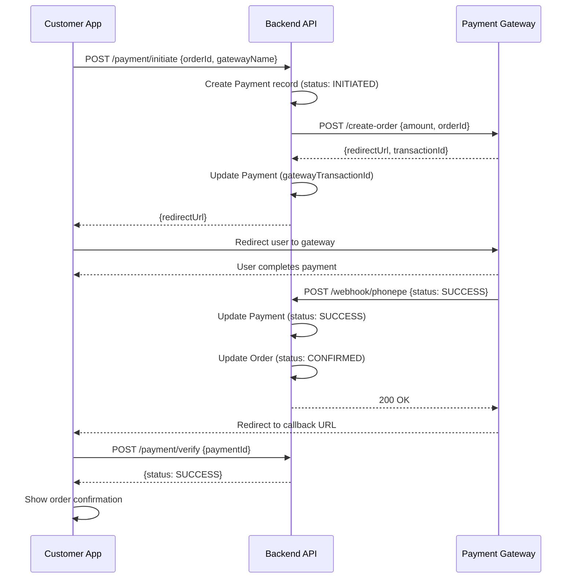
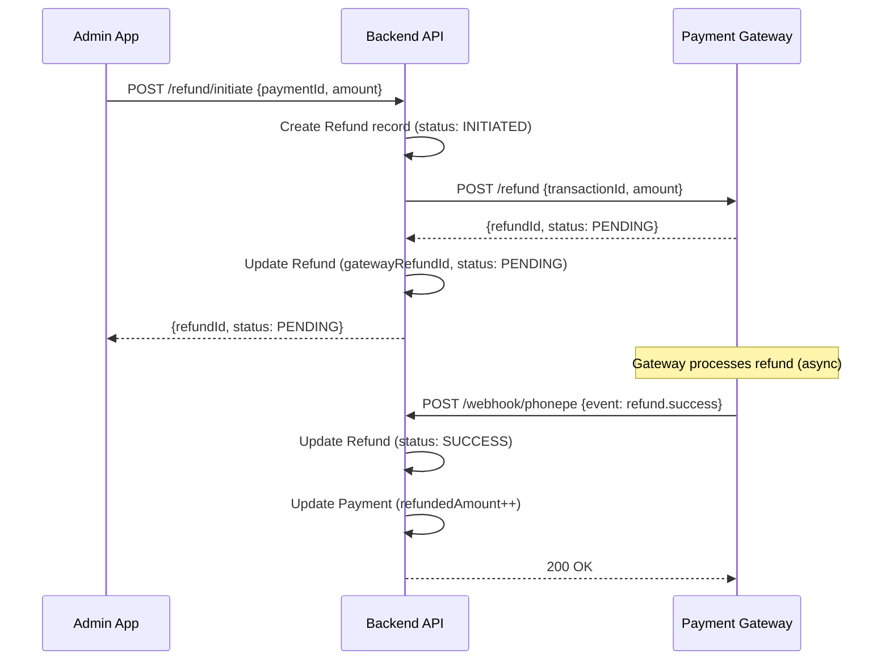

# API Flows - Payment Gateway Module

This document provides comprehensive API endpoint documentation for the payment gateway system.

---

## Base URLs

- **Customer**: `/api/v1/customer`
- **Admin**: `/api/v1/admin`
- **Webhook**: `/api/v1/webhook` (public, no auth)

---

## Customer APIs

### 1. Get Active Gateways

**Endpoint**: `GET /api/v1/customer/payment-gateway/active`  
**Auth**: Optional (JWT)  
**Purpose**: Fetch enabled payment gateways for checkout

**Response**:
```json
{
  "status": 200,
  "code": "SUCCESS",
  "message": "Active gateways fetched",
  "data": [
    {
      "_id": "gateway_id",
      "name": "phonepe",
      "displayName": "PhonePe",
      "priority": 1
    },
    {
      "_id": "gateway_id_2",
      "name": "razorpay",
      "displayName": "Razorpay",
      "priority": 2
    }
  ]
}
```

---

### 2. Initiate Payment

**Endpoint**: `POST /api/v1/customer/payment/initiate`  
**Auth**: Required (JWT)  
**Purpose**: Create payment and get gateway redirect URL

**Request**:
```json
{
  "orderId": "order_id_here",
  "gatewayName": "phonepe"
}
```

**Response (Redirect)**:
```json
{
  "status": 200,
  "code": "SUCCESS",
  "message": "Payment initiated",
  "data": {
    "paymentId": "pay_id",
    "redirectUrl": "https://phonepe.com/pay?...",
    "redirectMethod": "GET" // or "POST"
  }
}
```

**Response (SDK - Razorpay)**:
```json
{
  "status": 200,
  "code": "SUCCESS",
  "message": "Payment initiated",
  "data": {
    "paymentId": "pay_id",
    "razorpayOrderId": "order_xyz",
    "amount": 150000,
    "currency": "INR",
    "keyId": "rzp_test_key"
  }
}
```

**Error (Gateway Disabled)**:
```json
{
  "status": 400,
  "code": "GATEWAY_DISABLED",
  "message": "Selected payment gateway is disabled"
}
```

---

### 3. Verify Payment

**Endpoint**: `POST /api/v1/customer/payment/verify`  
**Auth**: Required (JWT)  
**Purpose**: Verify payment after gateway redirect

**Request (PhonePe/Paytm)**:
```json
{
  "paymentId": "pay_id",
  "gatewayData": {
    "transactionId": "gateway_txn_id"
  }
}
```

**Request (Razorpay)**:
```json
{
  "paymentId": "pay_id",
  "gatewayData": {
    "razorpay_order_id": "order_xyz",
    "razorpay_payment_id": "pay_xyz",
    "razorpay_signature": "signature_here"
  }
}
```

**Response (Success)**:
```json
{
  "status": 200,
  "code": "SUCCESS",
  "message": "Payment verified successfully",
  "data": {
    "paymentId": "pay_id",
    "orderId": "order_id",
    "status": "SUCCESS",
    "amount": 150000
  }
}
```

---

### 4. Get Payment Status

**Endpoint**: `GET /api/v1/customer/payment/:id`  
**Auth**: Required (JWT)  
**Purpose**: Poll payment status (for pending payments)

**Response**:
```json
{
  "status": 200,
  "code": "SUCCESS",
  "message": "Payment fetched",
  "data": {
    "_id": "pay_id",
    "orderId": "order_id",
    "status": "PENDING", // or "SUCCESS", "FAILED"
    "amount": 150000,
    "gatewayName": "phonepe",
    "createdAt": "2026-01-07T10:00:00Z"
  }
}
```

---

### 5. My Payments History

**Endpoint**: `POST /api/v1/customer/payment/myPayments`  
**Auth**: Required (JWT)  
**Purpose**: User's payment history

**Request**:
```json
{
  "page": 1,
  "limit": 10,
  "filters": {
    "status": "SUCCESS",
    "gatewayName": "phonepe"
  }
}
```

**Response**:
```json
{
  "status": 200,
  "code": "SUCCESS",
  "message": "Payments fetched",
  "data": {
    "recordList": [ /* payment objects */ ],
    "totalRecords": 25,
    "currentPage": 1,
    "totalPages": 3
  }
}
```

---

## Admin APIs

### 6. Get All Payment Gateways

**Endpoint**: `GET /api/v1/admin/payment-gateway/getAll`  
**Auth**: Required (JWT - Admin)  
**Purpose**: List all gateways with configurations

**Response**:
```json
{
  "status": 200,
  "code": "SUCCESS",
  "message": "Gateways fetched",
  "data": [
    {
      "_id": "gateway_id",
      "name": "phonepe",
      "displayName": "PhonePe",
      "isEnabled": true,
      "environment": "sandbox",
      "credentials": "***ENCRYPTED***", // Masked
      "priority": 1,
      "createdAt": "...",
      "updatedAt": "..."
    }
  ]
}
```

---

### 7. Update Gateway Configuration

**Endpoint**: `PUT /api/v1/admin/payment-gateway/:id/update`  
**Auth**: Required (JWT - Admin)  
**Purpose**: Update gateway credentials and settings

**Request**:
```json
{
  "isEnabled": true,
  "environment": "production",
  "credentials": {
    "merchantId": "new_merchant_id",
    "saltKey": "new_salt_key",
    "saltIndex": 1
  },
  "webhookSecret": "new_webhook_secret",
  "priority": 1
}
```

**Response**:
```json
{
  "status": 200,
  "code": "SUCCESS",
  "message": "Gateway updated successfully",
  "data": { /* updated gateway */ }
}
```

---

### 8. Toggle Gateway

**Endpoint**: `PUT /api/v1/admin/payment-gateway/:id/toggle`  
**Auth**: Required (JWT - Admin)  
**Purpose**: Quickly enable/disable gateway

**Request**:
```json
{
  "isEnabled": false
}
```

**Response**:
```json
{
  "status": 200,
  "code": "SUCCESS",
  "message": "Gateway toggled successfully"
}
```

---

### 9. Get All Payments (Admin)

**Endpoint**: `POST /api/v1/admin/payment/getAll`  
**Auth**: Required (JWT - Admin)  
**Purpose**: View all payments with advanced filters

**Request**:
```json
{
  "page": 1,
  "limit": 20,
  "filters": {
    "status": "SUCCESS",
    "gatewayName": "phonepe",
    "startDate": "2026-01-01",
    "endDate": "2026-01-07",
    "orderId": "optional_order_id",
    "userId": "optional_user_id"
  },
  "sortBy": "createdAt",
  "sortOrder": "desc"
}
```

**Response**: Paginated payment list

---

### 10. Initiate Refund

**Endpoint**: `POST /api/v1/admin/refund/initiate`  
**Auth**: Required (JWT - Admin)  
**Purpose**: Create refund request to gateway

**Request**:
```json
{
  "paymentId": "pay_id",
  "amount": 50000, // Partial refund
  "reason": "CUSTOMER_REQUEST",
  "notes": "Customer requested refund for damaged product"
}
```

**Response**:
```json
{
  "status": 200,
  "code": "SUCCESS",
  "message": "Refund initiated successfully",
  "data": {
    "refundId": "refund_id",
    "paymentId": "pay_id",
    "amount": 50000,
    "status": "PENDING",
    "gatewayRefundId": "gateway_refund_id"
  }
}
```

---

### 11. Get Refunds by Order

**Endpoint**: `GET /api/v1/admin/refund/order/:orderId`  
**Auth**: Required (JWT - Admin)  
**Purpose**: View all refunds for an order

**Response**:
```json
{
  "status": 200,
  "code": "SUCCESS",
  "message": "Refunds fetched",
  "data": [ /* refund objects */ ]
}
```

---

### 12. Sync Refund Status

**Endpoint**: `POST /api/v1/admin/refund/:id/sync`  
**Auth**: Required (JWT - Admin)  
**Purpose**: Manually poll gateway for refund status

**Response**:
```json
{
  "status": 200,
  "code": "SUCCESS",
  "message": "Refund status synced",
  "data": {
    "refundId": "refund_id",
    "status": "SUCCESS" // Updated status
  }
}
```

---

## Webhook APIs (Public)

### 13. PhonePe Webhook

**Endpoint**: `POST /api/v1/webhook/phonepe`  
**Auth**: None (signature verified)  
**Purpose**: Receive payment updates from PhonePe

**Request Headers**:
```
X-VERIFY: signature_here
Content-Type: application/json
```

**Request Body** (PhonePe format):
```json
{
  "merchantId": "MERCHANT_ID",
  "merchantTransactionId": "internal_payment_id",
  "transactionId": "phonepe_txn_id",
  "amount": 150000,
  "code": "PAYMENT_SUCCESS",
  "providerReferenceId": "provider_ref",
  "paymentInstrument": {
    "type": "UPI",
    "upiTransactionId": "upi_txn_id"
  }
}
```

**Response** (Always 200):
```json
{
  "success": true
}
```

**Internal Processing**:
1. Verify signature using webhook secret
2. Find payment by `merchantTransactionId`
3. Update payment status
4. Update order status
5. Log webhook to `webhook_logs`

---

### 14. Razorpay Webhook

**Endpoint**: `POST /api/v1/webhook/razorpay`  
**Auth**: None (signature verified)

**Request Headers**:
```
X-Razorpay-Signature: signature_here
Content-Type: application/json
```

**Request Body** (Razorpay event format):
```json
{
  "entity": "event",
  "event": "payment.captured",
  "payload": {
    "payment": {
      "entity": {
        "id": "pay_xyz",
        "order_id": "order_xyz",
        "amount": 150000,
        "currency": "INR",
        "status": "captured",
        "method": "upi",
        "vpa": "user@paytm"
      }
    }
  }
}
```

---

### 15. Paytm Webhook

**Endpoint**: `POST /api/v1/webhook/paytm`  
**Auth**: None (checksum verified)

**Request Body** (Paytm format):
```json
{
  "MID": "MERCHANT_ID",
  "ORDERID": "internal_payment_id",
  "TXNID": "paytm_txn_id",
  "TXNAMOUNT": "1500.00",
  "STATUS": "TXN_SUCCESS",
  "RESPCODE": "01",
  "CHECKSUMHASH": "checksum_here"
}
```

---

## Error Codes

| Code | HTTP Status | Description |
|------|-------------|-------------|
| SUCCESS | 200 | Request successful |
| VALIDATION_ERROR | 400 | Invalid request data |
| UNAUTHORIZED | 401 | Missing or invalid JWT |
| FORBIDDEN | 403 | Insufficient permissions |
| NOT_FOUND | 404 | Resource not found |
| GATEWAY_DISABLED | 400 | Selected gateway is disabled |
| GATEWAY_ERROR | 502 | Gateway API error |
| PAYMENT_ALREADY_PROCESSED | 409 | Payment already completed |
| REFUND_AMOUNT_EXCEEDS | 400 | Refund exceeds payment amount |
| INTERNAL_ERROR | 500 | Server error |

---

## Sequence Diagrams

### Payment Initiation Flow



### Refund Flow



---

**Testing Commands**:

```bash
# Get active gateways (customer)
curl -X GET http://localhost:8000/api/v1/customer/payment-gateway/active

# Initiate payment (customer - requires JWT)
curl -X POST http://localhost:8000/api/v1/customer/payment/initiate \
  -H "Authorization: Bearer <JWT_TOKEN>" \
  -H "Content-Type: application/json" \
  -d '{"orderId":"order_id","gatewayName":"phonepe"}'

# Admin get all gateways
curl -X GET http://localhost:8000/api/v1/admin/payment-gateway/getAll \
  -H "Authorization: Bearer <ADMIN_JWT_TOKEN>"
```

---

**Status**: ✅ API Documentation Complete
