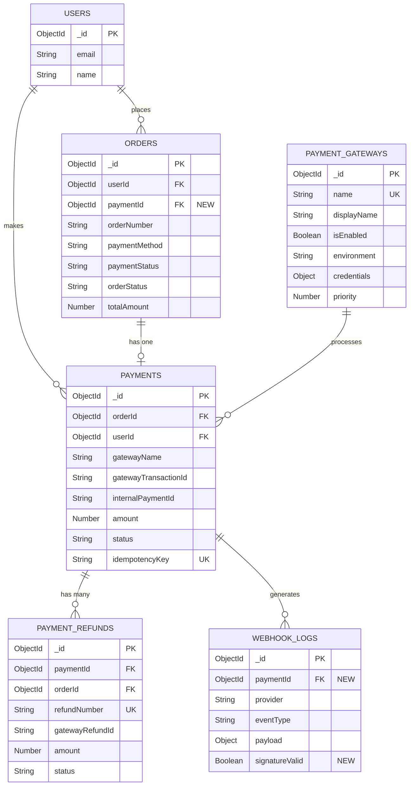

# Database Schema - Payment Gateway Module

## Overview

This document defines the complete database schema for the payment gateway module, including new collections, modifications to existing collections, indexes, and data migration strategies.

---

## New Collections

### 1. `payment_gateways`

Stores configuration for payment gateways (PhonePe, Razorpay, Paytm).

#### Schema Definition

```typescript
{
  _id: ObjectId,
  name: String,              // Unique: 'phonepe', 'razorpay', 'paytm'
  displayName: String,       // User-friendly: 'PhonePe', 'Razorpay', 'Paytm'
  isEnabled: Boolean,        // Admin toggle
  environment: String,       // 'sandbox' | 'production'
  credentials: {             // Encrypted JSON
    // PhonePe
    merchantId?: String,
    saltKey?: String,
    saltIndex?: Number,
    
    // Razorpay
    keyId?: String,
    keySecret?: String,
    
    // Paytm
    merchantId?: String,
    merchantKey?: String,
    website?: String
  },
  webhookSecret: String,     // For signature verification
  config: {                  // Gateway-specific settings
    callbackUrl?: String,    // Override default callback
    timeout?: Number,        // Payment timeout in seconds
    retryAttempts?: Number
  },
  priority: Number,          // Display order (1 = highest)
  createdAt: Date,
  updatedAt: Date
}
```

#### Indexes

```javascript
{ name: 1 } unique
{ isEnabled: 1, priority: 1 }
```

#### Seed Data

```javascript
[
  {
    name: 'phonepe',
    displayName: 'PhonePe',
    isEnabled: false,
    environment: 'sandbox',
    credentials: encrypt({
      merchantId: '',
      saltKey: '',
      saltIndex: 1
    }),
    webhookSecret: '',
    priority: 1
  },
  {
    name: 'razorpay',
    displayName: 'Razorpay',
    isEnabled: false,
    environment: 'sandbox',
    credentials: encrypt({
      keyId: '',
      keySecret: ''
    }),
    webhookSecret: '',
    priority: 2
  },
  {
    name: 'paytm',
    displayName: 'Paytm',
    isEnabled: false,
    environment: 'sandbox',
    credentials: encrypt({
      merchantId: '',
      merchantKey: '',
      website: 'WEBSTAGING'
    }),
    webhookSecret: '',
    priority: 3
  }
]
```

---

### 2. `payments`

Tracks individual payment transactions.

#### Schema Definition

```typescript
{
  _id: ObjectId,
  orderId: ObjectId,             // Required, ref: 'Order'
  userId: ObjectId,              // Required, ref: 'users'
  
  // Gateway information
  gatewayName: String,           // 'phonepe', 'razorpay', 'paytm'
  gatewayTransactionId: String,  // Gateway's transaction ID
  gatewayOrderId: String,        // Gateway's order ID (if different)
  internalPaymentId: String,     // Unique internal ID (generated)
  
  // Amount details
  amount: Number,                // In smallest currency unit (paise)
  currency: String,              // Default: 'INR'
  
  // Status tracking
  status: String,                // 'INITIATED' | 'PENDING' | 'SUCCESS' | 'FAILED' | 'REFUNDED' | 'PARTIAL_REFUND'
  
  // Metadata
  metadata: {                    // Gateway-specific response data
    paymentMethod?: String,      // 'UPI', 'CARD', 'NETBANKING', etc.
    upiId?: String,
    cardLast4?: String,
    cardNetwork?: String,
    bankName?: String,
    gatewayResponse?: Object     // Full gateway response
  },
  
  // Webhook processing
  webhookReceivedAt: Date,
  webhookProcessedAt: Date,
  
  // Idempotency
  idempotencyKey: String,        // Unique, prevents duplicate payments
  
  // Refund tracking
  refundedAmount: Number,        // Total refunded (for partial refunds)
  refundCount: Number,           // Number of refunds
  
  // Audit
  createdBy: ObjectId,           // ref: 'users'
  
  // Timestamps & soft delete
  createdAt: Date,
  updatedAt: Date,
  deletedAt: Date,
  deletedBy: ObjectId
}
```

#### Indexes

```javascript
{ orderId: 1 }
{ userId: 1, createdAt: -1 }
{ gatewayTransactionId: 1 }
{ internalPaymentId: 1 } unique
{ idempotencyKey: 1 } unique sparse
{ status: 1, createdAt: -1 }
{ gatewayName: 1, status: 1, createdAt: -1 }
{ deletedAt: 1 } // For soft deletes
```

#### Sample Document

```json
{
  "_id": "65a1b2c3d4e5f6g7h8i9j0k1",
  "orderId": "65a1b2c3d4e5f6g7h8i9j0k2",
  "userId": "65a1b2c3d4e5f6g7h8i9j0k3",
  "gatewayName": "phonepe",
  "gatewayTransactionId": "PHONEPE_TXN_123456",
  "gatewayOrderId": "ORDER_123456",
  "internalPaymentId": "PAY_20260107_001",
  "amount": 150000,
  "currency": "INR",
  "status": "SUCCESS",
  "metadata": {
    "paymentMethod": "UPI",
    "upiId": "user@paytm",
    "gatewayResponse": {
      "code": "PAYMENT_SUCCESS",
      "message": "Payment successful"
    }
  },
  "webhookReceivedAt": "2026-01-07T10:30:00Z",
  "webhookProcessedAt": "2026-01-07T10:30:02Z",
  "idempotencyKey": "order_65a1b2c3_gateway_phonepe",
  "refundedAmount": 0,
  "refundCount": 0,
  "createdAt": "2026-01-07T10:25:00Z",
  "updatedAt": "2026-01-07T10:30:02Z"
}
```

---

### 3. `payment_refunds`

Tracks refund requests and their status.

#### Schema Definition

```typescript
{
  _id: ObjectId,
  paymentId: ObjectId,           // Required, ref: 'Payment'
  orderId: ObjectId,             // Required, ref: 'Order'
  userId: ObjectId,              // Required, ref: 'users'
  
  // Refund details
  refundNumber: String,          // Unique internal refund ID
  gatewayRefundId: String,       // Gateway's refund transaction ID
  amount: Number,                // Amount to refund (in paise)
  reason: String,                // 'CUSTOMER_REQUEST', 'RETURN', 'RTO', etc.
  notes: String,                 // Admin notes
  
  // Status tracking
  status: String,                // 'INITIATED' | 'PENDING' | 'SUCCESS' | 'FAILED'
  
  // Gateway response
  gatewayResponse: Object,       // Full gateway refund response
  
  // Timestamps
  initiatedAt: Date,
  processedAt: Date,
  completedAt: Date,
  failedAt: Date,
  failureReason: String,
  
  // Audit
  initiatedBy: ObjectId,         // ref: 'users' (admin who initiated)
  processedBy: ObjectId,         // ref: 'users' (admin who processed)
  
  // Timestamps & soft delete
  createdAt: Date,
  updatedAt: Date,
  deletedAt: Date
}
```

#### Indexes

```javascript
{ paymentId: 1, createdAt: -1 }
{ orderId: 1 }
{ userId: 1 }
{ refundNumber: 1 } unique
{ gatewayRefundId: 1 }
{ status: 1, createdAt: -1 }
```

---

## Modified Collections

### `orders`

Add payment reference field.

#### New Fields

```typescript
{
  paymentId: ObjectId,  // ref: 'Payment', optional
}
```

#### New Index

```javascript
{ paymentId: 1 }
```

#### Migration Strategy

```javascript
// No data migration needed
// Existing orders without paymentId are COD or pre-implementation ONLINE orders
// New ONLINE orders will have paymentId populated
```

---

### `webhook_logs` (existing: `webhookLogModel`)

Add payment-specific fields.

#### New Fields

```typescript
{
  paymentId: ObjectId,       // ref: 'Payment', optional
  signatureValid: Boolean,   // Webhook signature verification result
}
```

#### New Index

```javascript
{ paymentId: 1, createdAt: -1 }
```

---

## Relationships Diagram



---

## Data Migrations

### Migration 001: Create New Collections

**File**: `backend/src/db/mongodb/migrations/001_create_payment_tables.ts`

```typescript
export async function up() {
  await PaymentGatewayModel.createCollection();
  await PaymentModel.createCollection();
  await PaymentRefundModel.createCollection();
  
  // Create indexes
  await PaymentGatewayModel.createIndexes();
  await PaymentModel.createIndexes();
  await PaymentRefundModel.createIndexes();
  
  console.log('Payment tables created successfully');
}

export async function down() {
  await PaymentGatewayModel.collection.drop();
  await PaymentModel.collection.drop();
  await PaymentRefundModel.collection.drop();
  
  console.log('Payment tables dropped');
}
```

---

### Migration 002: Seed Payment Gateways

**File**: `backend/src/db/mongodb/migrations/002_seed_payment_gateways.ts`

```typescript
import { PaymentGatewayModel } from '../models/paymentGatewayModel';
import { encrypt } from '../../../helpers/encryptionHelper';

export async function up() {
  const gateways = [
    {
      name: 'phonepe',
      displayName: 'PhonePe',
      isEnabled: false,
      environment: 'sandbox',
      credentials: encrypt(JSON.stringify({
        merchantId: process.env.PHONEPE_MERCHANT_ID || '',
        saltKey: process.env.PHONEPE_SALT_KEY || '',
        saltIndex: 1
      })),
      webhookSecret: process.env.PHONEPE_WEBHOOK_SECRET || '',
      config: {},
      priority: 1
    },
    {
      name: 'razorpay',
      displayName: 'Razorpay',
      isEnabled: false,
      environment: 'sandbox',
      credentials: encrypt(JSON.stringify({
        keyId: process.env.RAZORPAY_KEY_ID || '',
        keySecret: process.env.RAZORPAY_KEY_SECRET || ''
      })),
      webhookSecret: process.env.RAZORPAY_WEBHOOK_SECRET || '',
      config: {},
      priority: 2
    },
    {
      name: 'paytm',
      displayName: 'Paytm',
      isEnabled: false,
      environment: 'sandbox',
      credentials: encrypt(JSON.stringify({
        merchantId: process.env.PAYTM_MERCHANT_ID || '',
        merchantKey: process.env.PAYTM_MERCHANT_KEY || '',
        website: 'WEBSTAGING'
      })),
      webhookSecret: process.env.PAYTM_WEBHOOK_SECRET || '',
      config: {},
      priority: 3
    }
  ];
  
  await PaymentGatewayModel.insertMany(gateways);
  console.log('Payment gateways seeded successfully');
}

export async function down() {
  await PaymentGatewayModel.deleteMany({});
  console.log('Payment gateways removed');
}
```

---

### Migration 003: Update Order Model

**File**: `backend/src/db/mongodb/migrations/003_update_order_model.ts`

```typescript
import { OrderModel } from '../models/orderModel';

export async function up() {
  // Add index for paymentId field
  await OrderModel.collection.createIndex({ paymentId: 1 });
  
  console.log('Order model updated with paymentId index');
}

export async function down() {
  await OrderModel.collection.dropIndex('paymentId_1');
  console.log('Order paymentId index removed');
}
```

---

### Migration 004: Update Webhook Log Model

**File**: `backend/src/db/mongodb/migrations/004_update_webhook_log_model.ts`

```typescript
import { WebhookLogModel } from '../models/webhookLogModel';

export async function up() {
  // Add index for paymentId field
  await WebhookLogModel.collection.createIndex({ paymentId: 1, createdAt: -1 });
  
  console.log('WebhookLog model updated with paymentId index');
}

export async function down() {
  await WebhookLogModel.collection.dropIndex('paymentId_1_createdAt_-1');
  console.log('WebhookLog paymentId index removed');
}
```

---

## Environment Variables

Add to `.env`:

```bash
# Payment Gateway Configuration
ENCRYPTION_KEY=your-32-character-encryption-key

# PhonePe
PHONEPE_MERCHANT_ID=
PHONEPE_SALT_KEY=
PHONEPE_WEBHOOK_SECRET=
PHONEPE_API_URL_SANDBOX=https://api-preprod.phonepe.com/apis/pg-sandbox
PHONEPE_API_URL_PRODUCTION=https://api.phonepe.com/apis/hermes

# Razorpay
RAZORPAY_KEY_ID=
RAZORPAY_KEY_SECRET=
RAZORPAY_WEBHOOK_SECRET=

# Paytm
PAYTM_MERCHANT_ID=
PAYTM_MERCHANT_KEY=
PAYTM_WEBSITE=WEBSTAGING
PAYTM_WEBHOOK_SECRET=
PAYTM_API_URL_SANDBOX=https://securegw-stage.paytm.in
PAYTM_API_URL_PRODUCTION=https://securegw.paytm.in

# Callback URLs
CUSTOMER_APP_URL=http://localhost:5174
PAYMENT_CALLBACK_URL=${CUSTOMER_APP_URL}/payment/callback
```

---

## Data Retention & Cleanup

### Soft Delete Policy
- All payment and refund records use soft delete (`deletedAt` field)
- Actual deletion only after 7 years (compliance requirement)

### Webhook Logs Retention
- Keep webhook logs for 90 days
- Archive older logs to cold storage
- Cron job: `cleanupOldWebhookLogs` runs daily

### Cleanup Script

**File**: `backend/src/scripts/cleanupPaymentData.ts`

```typescript
import { WebhookLogModel } from '../db/mongodb/models/webhookLogModel';

export async function cleanupOldWebhookLogs() {
  const cutoffDate = new Date();
  cutoffDate.setDate(cutoffDate.getDate() - 90);
  
  const result = await WebhookLogModel.deleteMany({
    createdAt: { $lt: cutoffDate }
  });
  
  console.log(`Cleaned up ${result.deletedCount} old webhook logs`);
}
```

---

## Performance Considerations

### Expected Load
- **Orders/day**: ~1000 (estimated)
- **Payments/day**: ~700 (70% online)
- **Webhooks/day**: ~700 (1 per payment)
- **Refunds/day**: ~50 (5% refund rate)

### Index Optimization
- All foreign keys indexed
- Compound indexes for common queries (status + date)
- Unique constraints for idempotency

### Query Patterns
**Most Common Queries**:
1. Payment by order ID: `payments.find({ orderId })`
2. User payment history: `payments.find({ userId }).sort({ createdAt: -1 })`
3. Admin payment list: `payments.find({ status, createdAt: {$gte, $lte} })`
4. Webhook lookup: `webhookLogs.find({ paymentId })`

**Optimization**:
- All above queries use indexed fields
- Pagination for large result sets
- Caching for active gateway configurations (Redis)

---

## Security Considerations

### Credential Encryption
- AES-256-CBC encryption for `payment_gateways.credentials`
- Encryption key from environment variable (never in code)
- Decrypt only when needed (during payment initiation)

### PII Protection
- Never log full card numbers
- UPI IDs stored in metadata (encrypted at rest via MongoDB encryption)
- Payment metadata excludes sensitive details

### Audit Trail
- All payment operations logged with user ID and timestamp
- Webhook signature validation logged (`signatureValid` field)
- Failed verification attempts logged for security monitoring

---

## Testing Data

### Seed Test Gateways (Development Only)

**File**: `backend/src/db/mongodb/seeders/paymentGatewaySeeder.ts`

```typescript
export const testGateways = [
  {
    name: 'phonepe',
    displayName: 'PhonePe',
    isEnabled: true,
    environment: 'sandbox',
    credentials: encrypt(JSON.stringify({
      merchantId: 'PGTESTPAYUAT',
      saltKey: '099eb0cd-02cf-4e2a-8aca-3e6c6aff0399',
      saltIndex: 1
    })),
    webhookSecret: 'test-webhook-secret',
    priority: 1
  }
  // Add test credentials for Razorpay and Paytm
];
```

**Run Seeder**:
```bash
npm run seed:payment-gateways
```

---

**Ready for Implementation**: Database schema is complete and ready for migration scripts to be generated.
